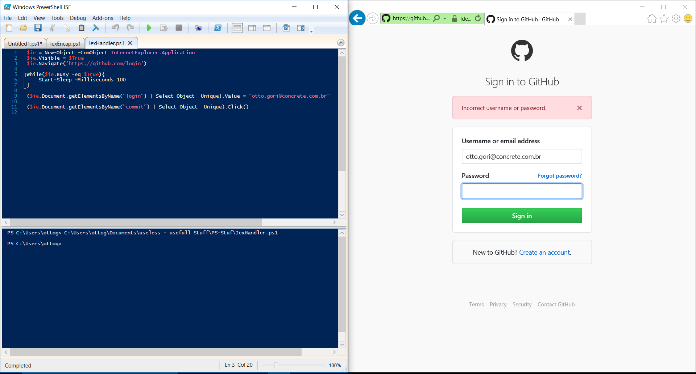

~~~powershell
    Write-Verbose 'Essa é uma linha que só aparecerá se eu chamar uma função com o switch "-verbose" '
~~~

Digamos que eu seja um Dev da pagina do github e recebi uma demanda para atualizar a método de login, de forma que se alguém digitar o usuário e não a senha, essa pessoa receba uma alerta e o login não seja efetuado. Preciso de uma evidencia do teste, no caso vamos de um print da tela.

Para testar meu código farei diversos deployments em meu ambiente de LAB e decidi automatizar o teste da pagina para que em todos os meus deployments eu receba um "ok" caso a ação de login tenha sido realizada ou um "não rodou" caso tenha ocorrido algum erro. 

A primeira coisa que terei de fazer é criar um COM-Object do Internet explorer. O controle de dotNET COM Objects é bem simples:

~~~powershell
    $ie = New-Object -ComObject InternetExplorer.Application
    $ie.Visible = $True
~~~

A segunda ação é navegar até a pagina do github e aguardar que o COM esteja livre para uso.

~~~powershell
    $ie.Navigate('https://github.com/login')

    While($ie.Busy -eq $True){
        Start-Sleep -Milliseconds 100
    }
~~~

>Caso tenha curiosidade, é possível utilizar dotSourcing para receber o conteudo da pagina, eg:
~~~powershell
    $ie.Document.Body.InnerText
~~~

Com a pagina carregada, preciso identificar os objetos da tela e popular seus valores, para tal, uso o mesmo trabalho acima com o recurso de dotSourcing.

~~~powershell
    $ie.Document.getElementsByName("login")
~~~ 

Porém, a linha acima me traz o objeto e oque eu quero é selecionar e popular com um texto, para isso uso outra função do posh, a "Select-Object" com o switch "-Unique" que faz desta uma seleção unaria.

~~~powershell
    $ie.Document.getElementsByName("login") | Select-Object -Unique
~~~

Seto então a propriedade "Value" deste objeto com o meu login do github.

~~~powershell
    ($ie.Document.getElementsByName("login") | Select-Object -Unique).Value = "otto.gori@concrete.com.br"
~~~

Observem a evolução da seleção quando executada na console:

~~~powershell
    C:\Users\ottog> $ie.Document.getElementsByName("login") | Select-Object -Unique | Format-Table

    className                id          tagName parentElement      style              onhelp onclick ondblclick onkeydown onkeyup
    ---------                --          ------- -------------      -----              ------ ------- ---------- --------- -------
    form-control input-block login_field INPUT   System.__ComObject System.__ComObject
~~~

Cada uma dessas propriedades é um objeto que pode ser expandido e trabalhado, digamos que eu queira saber o tipo deste objeto:

~~~powershell
    C:\Users\ottog> $ie.Document.getElementsByName("login") | Select-Object type | Format-Table

    type
    ----
    text
~~~

E assim segue.

Segundo nossa POC: Não vamos digitar a senha e vamos dar um hit no botão login.

Para isso usamos algo parecido, porém invocando o método "click" do proprio COM-Obj:

~~~powershell
    ($ie.Document.getElementsByName("commit") | Select-Object -Unique).Click()
~~~

Se executarmos o código (Tanto na ISE quanto na console), esse será o resultado:

Como evidencia de meu teste, quero um print da tela de login com a mensagem. Existem formas mais simples, mas quero mostrar uma forma bem "baixo nivel" de fazer isso que é controlando propriedades do sistema e assemblies do dotNet. Fica assim:

~~~powershell
    $bounds = [Drawing.Rectangle]::FromLTRB(0, 0, $monitor.Width, $monitor.Height)

    $monitor =  [System.Windows.Forms.SystemInformation]::PrimaryMonitorSize

    $bmp = New-Object Drawing.Bitmap $bounds.width, $bounds.height

    $graphics = [Drawing.Graphics]::FromImage($bmp)

    $graphics.CopyFromScreen($bounds.Location, [Drawing.Point]::Empty, $bounds.size)

    $bmp.Save("$HOME\print.png")

    $graphics.Dispose()
    $bmp.Dispose()
~~~

Terminado isso eu quero somente exibir automaticamente o print salvo. Para tal, basta invocar o caminho do arquivo.

~~~powershell
    Invoke-Item "$HOME\print.png"
~~~

Nosso código completo fica assim:

~~~powershell
    $ie = New-Object -ComObject InternetExplorer.Application
    $ie.Visible = $True

    $ie.Navigate('https://github.com/login')

    While($ie.Busy -eq $True){
        Start-Sleep -Milliseconds 100
    }

    ($ie.Document.getElementsByName("login") | Select-Object -Unique).Value = "otto.gori@concrete.com.br"

    ($ie.Document.getElementsByName("commit") | Select-Object -Unique).Click()

    While($ie.Busy -eq $True){
        Start-Sleep -Milliseconds 100
    }

    $monitor =  [System.Windows.Forms.SystemInformation]::PrimaryMonitorSize

    $bounds = [Drawing.Rectangle]::FromLTRB(0, 0, $monitor.Width, $monitor.Height)

    $bmp = New-Object Drawing.Bitmap $bounds.width, $bounds.height

    $graphics = [Drawing.Graphics]::FromImage($bmp)

    $graphics.CopyFromScreen($bounds.Location, [Drawing.Point]::Empty, $bounds.size)

    $bmp.Save("$HOME\print.png")

    $graphics.Dispose()
    $bmp.Dispose()

    Invoke-Item "$HOME\print.png"

    $ie.Quit()
~~~

No proximo módulo vamos fazer com que esse código não seja tão "straightforward" ... está vendo essas duas chamadas iguais do sleep ? vamos transformar ela numa função. Vê o hard coding? vamos remover. Vê como eu poderia criar um metodo handler para os elementos da pagina web? vê como poderia transformar esse print numa função também? ... Tudo isso será abordado aqui: [MODULO 2 - FUNÇÕES](../function/fnc.md)